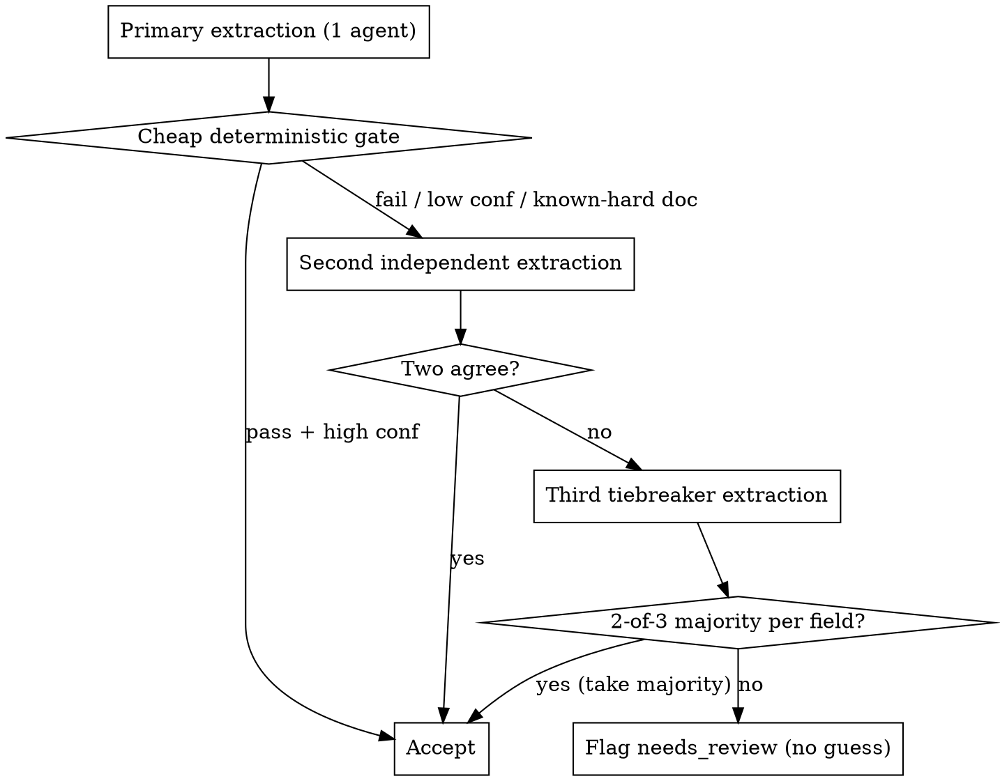

# Extracting fields from a media corpus (Workflow-native)

LLM-per-document extraction that **replaces** brittle regex/OCR/parsing where it fails, with a **consensus verification ladder** so results are deterministic-by-agreement. A subagent reads one document (text-layer, scanned, image, transcript, or web page — via parser or vision), extracts schema-validated fields with evidence quotes, and the orchestration cross-checks and re-runs only the disagreements.

**Core principle:** most documents are easy (1 agent); spend extra agents only on the hard or disagreeing ones. Agreement across independent extractions IS the determinism mechanism — you don't control per-agent temperature, so you buy reliability with votes, not settings.

This is the **measurement** engine. It extracts fields you already know you want. To *discover* which document features predict an outcome when you don't yet know them, use the **`autometrics`** skill, which calls this skill as its scoring primitive.

## When to use vs. when not

**Use LLM extraction for:**
- **Scanned / image-only documents** where OCR stalls or is lossy — a subagent `Read`s the file visually, no OCR pipeline, no GPU bottleneck. Same for screenshots, photographed pages, handwriting, diagrams with captions.
- **Multi-entity / multi-party rosters + per-entity outcomes** — lists where plural-list phrasing defeats regex ("the claims of parties 3, 4, and 5 are denied"; line items split across non-contiguous sections; one-row-per-party splitting).
- **Semantic classification** — category labels, holding/decision types, sentiment, "is this document actually in-scope," topic tags that depend on meaning, not keywords.
- **Free-text fields** — narrative summaries, named parties, remedies, reasons, anything where the value is prose the writer phrased freely.

**Keep on deterministic parsing (do NOT send these to an LLM — they're reliable and free):**
- Canonical structured fields with a single unambiguous source: IDs, docket/reference numbers, dates from a listing or cover, type labels from a listing, JSON the source already emits, URL-derived fields, file hashes, page/word counts. If a regex or a parser already nails it 100%, an LLM only adds cost and a hallucination surface.

The split is the whole game: let the cheap deterministic path handle the easy majority, and aim the expensive LLM fan-out at the genuinely hard subset.

## Orchestration as a Dynamic Workflow

Run the extraction as a **Workflow** (`agent()` / `parallel()` / `pipeline()`), not as a hand-spawned loop of Agent-tool subagents. Workflow agents **cannot** spawn further Agent-tool subagents — the fan-out IS the workflow's `pipeline()`. Do not write a "manager dispatches Agent() per document" loop inside a workflow agent.

### The 1000-agent-per-run cap — budget it

Each Workflow run is hard-capped at **1000 total `agent()` calls**. The verification ladder costs up to 3 agents per hard document, so:

```
total_agents ≈ N_docs × avg_agents_per_doc   (keep under ~900 for headroom)
```

- If `avg_agents_per_doc ≈ 1.3` (most documents accepted on the first pass), ~650 docs/run is safe.
- For corpora bigger than that, **chunk across multiple Workflow runs** — one run per ~600-doc batch, each writing to its own output shard; a final small step merges shards. Never silently truncate: `log()` the chunk boundaries so coverage is auditable. (A logged "processed 600 of 3,000" with no plan for the other 2,400 is a silent fallback — the log is a TODO, not a resolution.)
- Restrict the fan-out to the **hard subset** where possible (scanned + multi-party + semantic-classification docs), letting deterministic parsing handle the easy majority — this keeps `N_docs` small.

### The verification ladder (deterministic-by-agreement)



- **Cheap deterministic gate** (no extra agent): does the primary output pass structured cross-checks? — every non-null field has an `evidence_quote`; numeric fields are in valid range; deterministically-reliable fields (IDs, dates) match the parser's value; flags are internally consistent. Pass + `confidence:"high"` → **accept on 1 agent**.
- **Known-hard documents** (scanned, multi-entity, semantic-classification) skip the gate and go straight to 2-extraction consensus.
- **Disagreement → tiebreaker, per-field 2-of-3 majority.** No majority on a field → that field is `needs_review`, never guessed.

### Skeleton

```js
const HARD = (d) => d.scanned || d.multi_party || d.semantic_class
const verified = await pipeline(
  docs,
  (d) => agent(extractPrompt(d), { schema: DOC_SCHEMA, label: `x1:${d.id}` }),      // primary
  (p, d) => {
    if (!HARD(d) && p.confidence === 'high' && cheapGatePasses(p, d)) return p       // accept on 1
    return agent(extractPrompt(d), { schema: DOC_SCHEMA, label: `x2:${d.id}` })      // second
      .then(async (q) => {
        if (fieldsAgree(p, q)) return merge(p, q)                                    // accept on 2
        const r = await agent(extractPrompt(d), { schema: DOC_SCHEMA, label: `x3:${d.id}` })
        return majority3(p, q, r)                                                    // 2-of-3 or needs_review
      })
  },
)
```

`cheapGatePasses`, `fieldsAgree`, `majority3` are plain JS comparing the structured outputs — no agents. Extraction agents **return** structured data (they do not write the store); a final load step bulk-inserts `verified` to avoid concurrent-writer contention.

## Per-document extraction method (what one agent does)

1. Read the project guardrails and the anti-hallucination rules below.
2. Read the target schema (Pydantic/JSON Schema) for this document type.
3. **Open the media.**
   - Text-layer PDF → parse the text (e.g. PyMuPDF / `fitz`).
   - Scanned / near-empty text (`len(text.strip()) / page_count < 100`), images, screenshots → **`Read` the file visually**; the model reads the pixels directly, no OCR.
   - Audio/video → transcribe first, then extract from the transcript.
   - Web page → fetch and extract from the rendered text, noting the selector if structure matters.
4. **Pull only the relevant excerpts for long documents.** Use deterministic anchors (regex, headers, selectors) to *locate* the right section, not an LLM to choose excerpts — locate cheaply, reason expensively. Feed the agent the cover/header for top-level fields and the per-entity sections for roster rows.
5. Fill each schema field from the excerpt. Validate types/enums; retry once on validation failure.
6. Emit `evidence_quotes` (a short source quote, ≤~40 words, per non-null field), `confidence` (high/medium/low), `parse_warnings`, and `needs_review`.

## Anti-hallucination guardrails (CRITICAL)

- **Never invent values.** Not in the document → null. This holds hardest for numbers and names.
- **Redacted ≠ absent.** A redaction (`***`, `[REDACTED]`, word-bisected `Reda\ncted`, a black box) → null + set the corresponding `*_redacted=true`. Don't guess behind the redaction; the redaction itself is often the finding.
- **Quote your source** for every non-null field. Can't quote it → null.
- **Count entities by structural markers** (section headers, list delimiters, row boundaries), not by text density or vibe.
- **Uncertain → null + `parse_warnings`.** Incomplete beats wrong. A field flagged `needs_review` is honest; a confidently-wrong field poisons everything downstream of it.

## Adapting to your corpus (do the function-driven pre-work first)

Before writing a single prompt, map what the corpus actually *is* — this is the heterogeneity pass, and skipping it is the main reason extraction silently degrades on the long tail:

- **Inventory the source types.** Text PDFs vs. scans vs. images vs. transcripts vs. HTML each need a different open-the-media path (step 3). Sample each, don't assume one path covers all.
- **Map the heterogeneity, not just the schema.** Edge populations (single-party vs. multi-party docs), mixed regimes (one document holding two outcomes), scale boundaries (a 2-page cover vs. a 400-page record), dirty inputs (OCR-mangled dates, encoding errors, inconsistent cover formats). Each of these is a place a happy-path prompt breaks.
- **Write per-source-type notes** capturing what's reliable-by-regex vs. what needs the LLM, the known dirty patterns, and the field-by-field "where does this live in this document type." This per-type note is the artifact that lets a fresh subagent extract correctly without re-deriving the corpus.
- **Validate on real data, manually.** Pull a handful of `verified` rows and the documents they came from and read them side by side. A passing schema validation is not evidence the field is *right* — read the evidence quotes against the source and confirm the extraction actually did the work.

## Failure modes

- OCR/vision both return empty → encrypted/unreadable file: set `extraction_method=failed`, log it, don't loop.
- Schema validation fails twice → log both attempts, set `needs_review=true`, move on.
- Tempted to guess a number → STOP. null + `parse_warnings`.
- Entities out of order → reconcile by section-header text, not by numeric assumption.
- "80% match rate, continued" → that's a silent fallback. The 20% that didn't match is a TODO; surface it, don't bury it in a log line.

## See also

- The **Workflow** tool — `pipeline()` / `parallel()` are the fan-out; this skill is one of the canonical pipeline shapes (extract → verify).
- **`autometrics`** — the discovery skill that calls this one as its scoring primitive: autometrics *discovers* which features matter; this skill *measures* known fields at scale.
- Project guardrails (CLAUDE.md) — function-driven research: test on real data and real heterogeneity, never smoke; never silently fallback.
